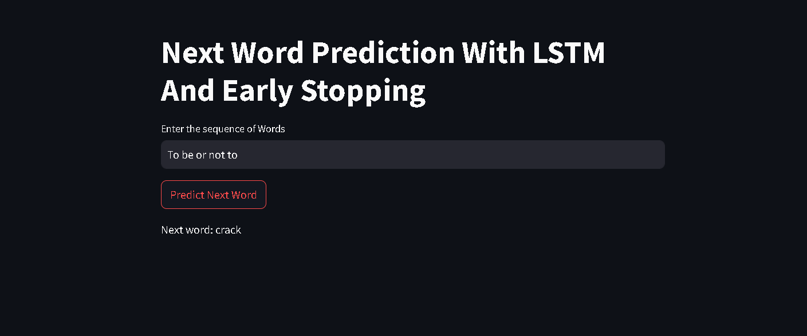

### **📌 ANN Classification Churn** 🚀  

**An advanced LSTM RNN-based deep learning model designed for next-word prediction. This model processes sequential text data using deep learning techniques to generate accurate and context-aware word predictions in real-time. It is trained on Shakespeare's Hamlet to enhance its language understanding and predictive capabilities.**  

🔗 **GitHub Repository:** [LSTM-RNN-Next-Word-Prediction](https://github.com/laavanjan/LSTM-RNN-Next-Word-Prediction)  
🌐 **Live Streamlit App:** [View Here](https://lstm-rnn-next-word-prediction-maccjvzsqpjngzjehhaj7r.streamlit.app/)  

---

## **📂 Features**  

✅ Preprocessed dataset for accurate predictions  
✅ Fully connected ANN with optimized hyperparameters  
✅ Model evaluation with performance metrics 📊  
✅ Interactive UI via Streamlit for real-time classification 🎨  
✅ TensorBoard integration for visualization 🖥️  

---

## **🛠️ Used Technologies**

- Python 3.11  
- TensorFlow 2.15.0  
- Pandas, NumPy, Scikit-Learn  
- TensorBoard  
- Matplotlib  
- Streamlit
- Jupyter notebook  

---

## **⚙️ Installation & Setup**  

### **1️⃣ Clone the repository**  

```bash
git clone https://github.com/laavanjan/ANN-classification-churn.git
cd ANN-classification-churn
```

### **2️⃣ Create and activate a Conda environment**  

```bash
conda create --name ann_env python=3.11 -y
conda activate ann_env
```

### **3️⃣ Install dependencies**  

```bash
pip install -r requirements.txt
```

Alternatively, install manually:  

```bash
pip install tensorflow==2.15.0 pandas numpy scikit-learn tensorboard matplotlib streamlit ipykernel
```

---

## **🚀 Usage**  

### **Running the Model**  

```bash
python app.py  # Modify as needed
```

### **Launching Streamlit UI**  

```bash
streamlit run app.py
```

Then open `http://localhost:8501/` in your browser.  

---

## **📊 Model Training & Evaluation**  

- 📈 The model is trained on labeled customer data.  
- 🔄 Uses backpropagation and optimizer tuning for improved accuracy.  
- 🎯 Evaluated using precision, recall, and F1-score metrics.  


## **🖼️ Screenshots**  

  

---

## **🤝 Contributing**  

💡 Contributions are welcome! Fork the repo, create a new branch, and submit a pull request. 🚀  

---

## **📝 License**  

This project is licensed under the GPL License. ⚖️  

---

### ⭐ **Don't forget to star the repo if you find it useful!** 🌟  

---

